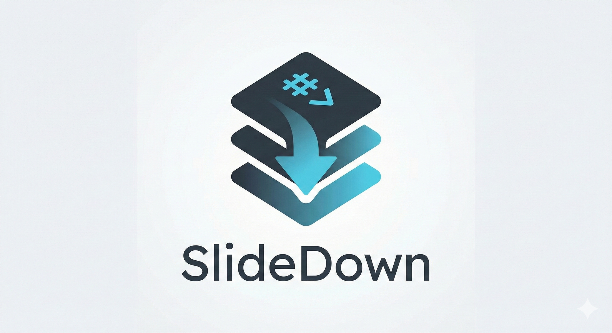

<div align="center">
  
  
  <!-- Alternative compact version: -->
  <!--  -->
  
  <p><strong>A minimalist, markdown-based presentation framework designed for developers and educators.</strong></p>
</div>

---

SlideDown combines the simplicity of Markdown with powerful "scrollytelling" capabilities, allowing you to create immersive, scroll-driven presentations without writing a single line of JavaScript.

## Live Demo

Check out the demo presentations running live on GitHub Pages:
[Link to your GitHub Pages URL]

You can verify the source code for these demos in the `content/` folder of this repository:
- **General Features**: `content/demo-features`
- **Scrollytelling**: `content/demo-scrolly`

## Features

- **Markdown First**: Write your slides in standard Markdown (`.md`).
- **Scrollytelling**: Create progressive reveals and sticky layouts simply by scrolling.
- **Zero Build Step**: No webpack, no build process. Just serve `index.html`.
- **Syntax Highlighting**: Automatic highlighting for code blocks (Python, JS, etc.).
- **Math Equations**: Beautiful LaTeX-style math rendering with KaTeX support.
- **Flexible Layouts**: Easily create multi-column layouts with custom ratios (e.g., 30/70 splits).
- **Components**: Built-in support for Images (with zoom & sizing), YouTube embeds and Iframes.
- **Theming**: Built-in Dark and Light color themes (Toggle with 'T').
- **Font Themes**: 4 distinct font styles from classic serif to modern sans-serif (Cycle with 'F').
- **Smart Zoom**: Automatically maintains slide position when browser zoom changes.

## SlideDown Language Guide

SlideDown extends Markdown with a few simple directives to handle layout and interactivity.

### Basic Structure
Slides are separated by horizontal rules (`---`). The separator must be **exactly three dashes** on a new line, optionally followed by spaces. Using more dashes (e.g., `----`) is interpreted as a standard Markdown horizontal rule, not a slide separator.

```markdown
# Slide 1
Content...

---

# Slide 2
Content...
```

### Layouts
Use `:::` to create blocks. Common blocks include `row`, `col` (or `column`), and `center`.

**Basic Two-Column Layout**:
```markdown
::: row
::: col
# Left Column
Content here
:::
::: col
# Right Column
Content here
:::
:::
```

**Custom Column Ratios**:
Control the width of columns (or height of rows) using the `ratio` parameter. You can specify the ratio as a percentage either with `ratio=XX%` or as a standalone `XX%` value.

```markdown
::: row
::: col ratio=30%
# Narrow Left (30%)
:::
::: col ratio=70%
# Wide Right (70%)
:::
:::

# Alternative syntax (standalone percentage):
::: row
::: col 40%
# 40% width
:::
::: col 60%
# 60% width
:::
:::
```

**Note**: The framework automatically accounts for gaps between columns, ensuring your ratios work correctly even with the built-in 2% spacing.

### Components
Use `::` to insert components. Attributes can be unquoted (if no spaces) or quoted.

**Images**:
Use `:: image` or `:: img`. All images support click-to-zoom functionality. Supports `width`, `height`, and `style` attributes.
```markdown
:: image src=my-image.png width=500
:: img src="image with spaces.png" alt="My Description" width=100% height=300px
:: image src=photo.jpg style="border-radius: 8px; box-shadow: 0 4px 6px rgba(0,0,0,0.1)"
```

**Image Sizing**:
- Use `width=100%` to make images fill their container (works perfectly with column ratios)
- Use pixel values like `width=400` for fixed sizes
- Mix with column ratios for precise layouts (e.g., image with `width=100%` in a `col ratio=40%`)
- Images can be zoomed by clicking on them and dragged when zoomed

**YouTube**:
```markdown
:: youtube id=dQw4w9WgXcQ
```

**Iframe**:
Embed external content.
```markdown
:: iframe src="https://example.com"
```

### Scrollytelling (Reveals)
To make items appear one by one as you scroll, use the `reveal` block or `reveal` variant.

**List Reveal**:
```markdown
::: reveal
- Item 1 appears first
- Then Item 2
- Then Item 3
:::
```

**Split Screen Reveal**:
Keep one column fixed while the other reveals content.

```markdown
::: row
::: col
# Fixed Content
 This stays visible.
:::
::: col reveal
- Step 1 explanation
- Step 2 explanation
:::
:::
```

**Combining Ratios with Reveals**:
You can combine column ratios with reveal effects for powerful presentations:

```markdown
::: row
::: col ratio=40%
:: image src=diagram.png width=100%
:::
::: col ratio=60% reveal
- First explanation point
- Second explanation point
- Third explanation point
:::
:::
```


### Syntax Highlighting
Just use standard markdown code fences.

\`\`\`python
def hello():
    print("Hello World!")
```

### Math Equations (KaTeX)
SlideDown supports beautiful LaTeX-style math rendering using KaTeX.

**Inline Math**:
Use single dollar signs for inline equations.
```markdown
The famous equation $E = mc^2$ was discovered by Einstein.
The quadratic formula is $x = \frac{-b \pm \sqrt{b^2-4ac}}{2a}$.
```

**Display Math**:
Use double dollar signs for centered display equations.
```markdown
$$
\int_{-\infty}^{\infty} e^{-x^2} dx = \sqrt{\pi}
$$

$$
\sum_{i=1}^{n} i = \frac{n(n+1)}{2}
$$
```

KaTeX supports most LaTeX math syntax including Greek letters, matrices, integrals, summations, and more.

### Font Themes
SlideDown includes 4 distinct font themes that work independently from color themes:

1. **Modern Sans** (Default) - Clean, readable sans-serif fonts
2. **Classic Serif** - Traditional serif fonts for academic content
3. **Tech Modern** - Contemporary web fonts (Inter, JetBrains Mono)
4. **Elegant Serif** - Sophisticated serif fonts (Crimson Pro, Source Code Pro)

**Keyboard Shortcuts**:
- Press **`F`** to cycle through font themes
- Press **`T`** to toggle between dark/light color themes

Your font theme preference is automatically saved and remembered across sessions.

**Note**: Tech Modern and Elegant Serif themes require an internet connection to load fonts from Google Fonts.

## Advanced Usage

### URL Parameters
- `?p=folder_name`: Loads the presentation from `content/folder_name`.
- `?f=https://example.com/my-slides`: Sets a custom base URL for content. The app will look for `index.json` and slides at this URL.

## Hosting Content Separately
You can host your slides in a separate repository (e.g., `https://esperanc.github.io/Python-2026`) and use SlideDown as a viewer.

1.  **Repository Structure**: Your content repo should have an `index.json` and folder(s) with `slides.md`.
2.  **Redirect**: To make your content repo URL open SlideDown automatically, create an `index.html` in your content repo with the following redirect code:

```html
<!DOCTYPE html>
<html lang="en">
<head>
    <meta charset="UTF-8">
    <meta http-equiv="refresh" content="0;url=https://esperanc.github.io/SlideDown?f=https://esperanc.github.io/Python-2026">
    <script>
        // Redirect logic to handle sub-paths/parameters if needed
        const targetBase = "https://esperanc.github.io/SlideDown";
        const contentUrl = "https://esperanc.github.io/Python-2026";
        window.location.href = `${targetBase}?f=${contentUrl}`;
    </script>
    <title>Redirecting...</title>
</head>
<body>
    <p>Redirecting to presentation viewer...</p>
</body>
</html>
```

## Running Locally

1.  Clone the repository.
2.  Serve the folder with any static file server.
    *   Python: `python3 -m http.server`
    *   Node: `npx serve`
    *   VS Code: "Live Server" extension
3.  Open `http://localhost:8000` (or your server's port).

## Project Structure

- `index.html`: The main entry point.
- `content/`: Folder containing your presentation subfolders.
- `content/index.json`: Registry of available presentations.
- `lib/`: Core logic (Parser, Renderer, Navigation, Themes).
